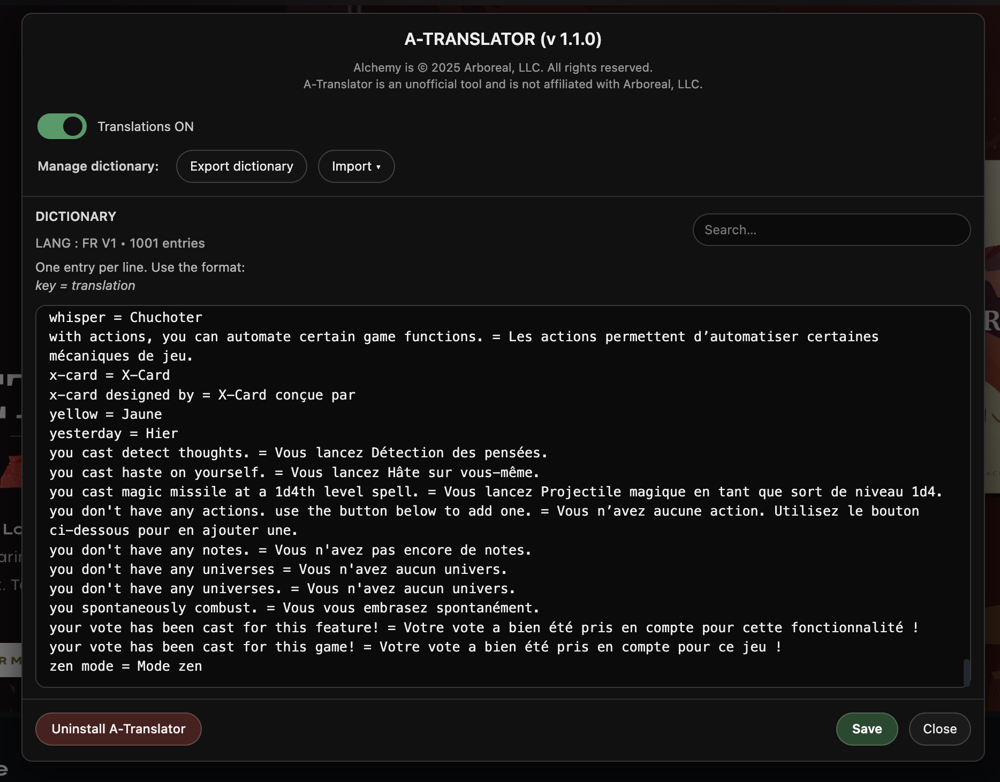

# A-Translator

Unofficial UI translation tool for **Alchemy VTT**, based on a user-editable dictionary.
 A-Translator allows you to translate Alchemy’s interface locally using your own terms, without modifying the platform or its content.

## What is A-Translator?

A-Translator is a **Tampermonkey userscript** that:
- Translates Alchemy VTT’s interface text
- Uses a **simple dictionary** (`key = translation`)
- Applies translations dynamically as the UI updates
- Lets you enable/disable translations at any time
- Stores everything **locally in your browser**

No data is sent anywhere.

## What A-Translator is NOT

- Not an official Alchemy feature  
- Not affiliated with Arboreal, LLC  
- Not a machine translation tool  
- Not modifying Alchemy servers or content  

This is a **client-side accessibility / localization helper**.

## Installation

### 1. Install Tampermonkey
- Chrome / Edge / Brave: https://www.tampermonkey.net/
- Firefox: https://www.tampermonkey.net/

### 2. Configure Tampermonkey (IMPORTANT)
Before installing A-Translator, make sure Tampermonkey is correctly configured.

Open **Tampermonkey Dashboard → Settings** and ensure:
- **Developer mode** is enabled  
- **Allow User Scripts** is enabled  
- **Allow access to file URLs** (recommended)
- **Allow scripts in private / incognito windows**  
If these options are disabled, the script may install correctly but **will not run**.

### 3. Install A-Translator
Open this link and confirm installation: 
**https://raw.githubusercontent.com/BriocheMasquee/a-translator/main/userscript/a-translator.user.js** 
Tampermonkey will prompt you to install or update the script.

## Usage
- Open **https://app.alchemyrpg.com/**
- A floating button appears on the left side
- Click it to open the A-Translator panel
- Edit your dictionary.
- Save → translations apply 
***Note:** You may need to reload the page once after the first installation.*

You can:
- Export / import dictionaries (JSON)
- Merge or replace dictionaries
- Disable translations at any time

## Dictionaries
This repository includes:
- A **base French dictionary** ready to import  
  → `dictionaries/fr-dict-v1.json`
- A **blank dictionary template**  
  → `dictionaries/template-dict-v1.json`

Both files can be imported directly from the A-Translator interface.

### Dictionary metadata
Dictionaries use a structured format with a `meta` section and an `entries` section.

The `meta` block stores non-editable information used by A-Translator:
- `lang` — language code of the dictionary (e.g. `fr`, `en`)
- `dictVersion` — dictionary version number
- `scriptVersion` — A-Translator script version used to generate the file

This metadata is:
- automatically included on export,
- displayed read-only in the editor,
- preserved and merged on import,
- fully backward-compatible with older dictionary files.

### Community contributions
If you create a dictionary for another language, feel free to share it.  
I’m happy to host community-made dictionaries in this repository so others can benefit from them.

## Uninstall
Before uninstalling, **disable the A-Translator script in Tampermonkey**.

Then:
- Open the A-Translator panel
- Click the **Uninstall** button

This removes the UI, loader, script, and local dictionary from your browser. 
You can re-enable or remove the Tampermonkey script afterwards if needed.

## Disclaimer
*Alchemy* is © Arboreal, LLC.  
A-Translator is an **unofficial community tool** and is not affiliated with Arboreal, LLC.
Use at your own discretion.

## License
MIT License
